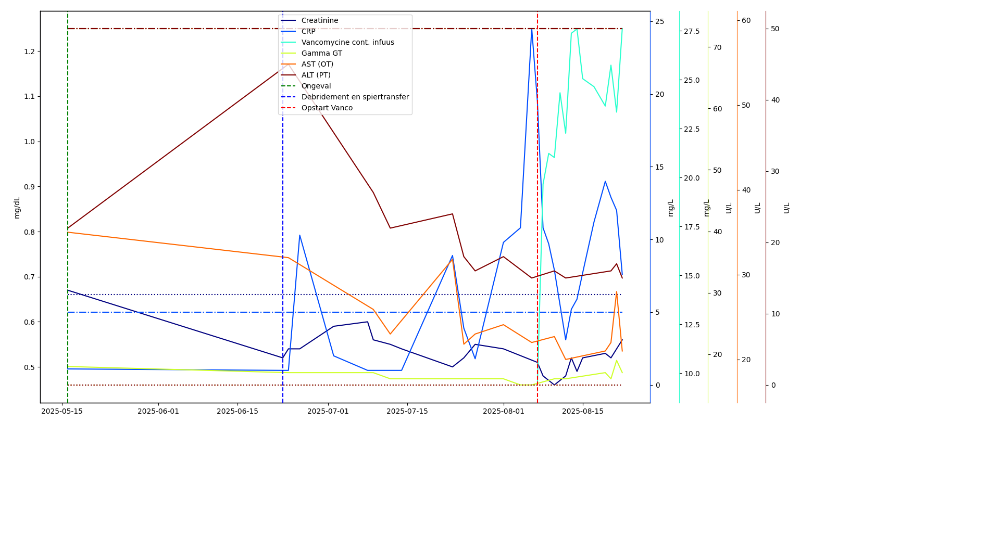

Dit python script leest pdf bestanden (in het formaat van Jan Palfijn ziekenhuis) met resultaten van bloedonderzoeken in.
De output is een data.csv bestand en een grafiek die enkele parameters plot ifv de tijd.
- Plaats de bestanden in inputDir. Voorbeeld bestandsnaam: *Naam-Voornaam-20250822-AZ_Jan_Palfijn_Gent-0_A_68813785_5.pdf*
- Plaats de gewenste parameters in parameters array
- In de events array kunnen gebeurtenissen worden toegevoegd die in de grafiek worden weergegeven
Meer info over kleur en lijntypes: https://matplotlib.org/stable/api/_as_gen/matplotlib.pyplot.plot.html
- Het csv bestand komt in outputDir terecht
- De grafiek met parameters word full screen geopend
